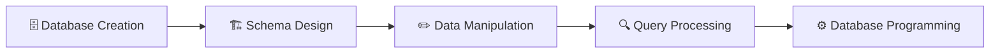

<div align="center">

# 🗄️✨ SQL Database Lab
### *Tables, joins, and stored procedures — MySQL edition*

[](https://www.mysql.com/)
[](https://en.wikipedia.org/wiki/SQL)
[](https://www.mysql.com/products/workbench/)

[](#-license)
[](#)


*8 scripts. 3 databases. 1 very well-organized relational world.* 🗂️

</div>

---

## 📖 What's This All About?

This is a hands-on **SQL laboratory** covering everything from `SELECT *` basics to stored procedures — built around the classic **ClassicModels** sample database, plus a couple of custom ones for good measure.

Think of it as a guided tour through the relational database universe: create it, shape it, fill it, query it, join it, and eventually teach it to run its own reusable logic. 🧩

<details>
<summary><strong>🔍 Peek inside the repo</strong></summary>

- 🧮 SQL basics & built-in functions
- 🏢 The ClassicModels business database
- 💬 SQL comments & documentation style
- 🏗️ Data Definition Language (DDL)
- ✏️ Data Manipulation Language (DML)
- 🔍 SELECT queries & filtering
- 🔗 SQL Joins (Inner, Left, Right, Cross)
- ⚙️ Stored Procedures

</details>

---

## 🗂️ The Scripts

<div align="center">

| # | Script | Focus |
|:-:|:--|:--|
| 1 | `basics.sql` | SQL fundamentals & built-in functions |
| 2 | `classic_models.sql` | Import the ClassicModels sample database |
| 3 | `comments.sql` | Comment styles & table inspection |
| 4 | `DDLDemo.sql` | Database & table schema operations |
| 5 | `DMLDemo.sql` | INSERT · UPDATE · DELETE · SELECT |
| 6 | `SelectDemo1.sql` | SELECT queries & filtering fundamentals |
| 7 | `JoinsDemo.sql` | INNER · LEFT · RIGHT · CROSS joins |
| 8 | `StoredProceduresDemo.sql` | Reusable SQL procedures |

</div>

---

### 🧮 1. SQL Basics
**`basics.sql`**

<details>
<summary>Show details 👇</summary>

The "hello world" of SQL — current date/time, math operations, checking the MySQL version, and creating your very first database.

**Covers:** Built-in functions · `CREATE DATABASE mydb` · Switching active databases

</details>

---

### 🏢 2. ClassicModels Database
**`classic_models.sql`**

<details>
<summary>Show details 👇</summary>

Imports the legendary **ClassicModels** sample database — a realistic retail business dataset that's basically the SQL learner's rite of passage.

**Tables:** Customers · Employees · Offices · Orders · Products · Product Lines · Payments · Order Details

</details>

---

### 💬 3. SQL Comments
**`comments.sql`**

<details>
<summary>Show details 👇</summary>

Because even SQL scripts deserve good documentation.

**Covers:** Single-line comments · Multi-line comments · Database selection · Displaying/viewing tables

</details>

---

### 🏗️ 4. Data Definition Language (DDL)
**`DDLDemo.sql`**

<details>
<summary>Show details 👇</summary>

Shaping the schema: creating, altering, and dropping databases and tables.

**Covers:** `CREATE`/`USE DATABASE` · `CREATE`/`ALTER`/`DROP`/`DESCRIBE TABLE` · Add/Modify/Rename/Delete columns · `PRIMARY KEY`, `AUTO_INCREMENT`, `NOT NULL`

**Custom databases:** `sonicdb` · `coforgedb`

</details>

---

### ✏️ 5. Data Manipulation Language (DML)
**`DMLDemo.sql`**

<details>
<summary>Show details 👇</summary>

Getting data in, out, and updated.

**Covers:** `INSERT` · `UPDATE` · `DELETE` · `SELECT`

**Examples:** Backup table creation · Inserting employee/department records · Updating & deleting records

</details>

---

### 🔍 6. SELECT Queries
**`SelectDemo1.sql`**

<details>
<summary>Show details 👇</summary>

The bread and butter of SQL — asking the database questions and getting answers back.

**Covers:** `SELECT` · `WHERE` · `ORDER BY` · `DISTINCT` · `LIMIT` · Aliases · Arithmetic expressions · Built-in functions

**Also introduces:** Databases, Tables, Records, Fields, RDBMS concepts, SQL categories

</details>

---

### 🔗 7. SQL Joins
**`JoinsDemo.sql`**

<details>
<summary>Show details 👇</summary>

Combining tables like a matchmaker with a foreign key.

| Join Type | What It Does |
|:--|:--|
| 🔵 Inner Join | Matching rows only |
| ⬅️ Left Join | All from left + matches from right |
| ➡️ Right Join | All from right + matches from left |
| ✖️ Cross Join | The full Cartesian product |

**Examples:** Employees ↔ Offices · Products ↔ Product Lines · Customers ↔ Orders

</details>

---

### ⚙️ 8. Stored Procedures
**`StoredProceduresDemo.sql`**

<details>
<summary>Show details 👇</summary>

Packaging up SQL logic so you never have to write the same query twice.

**Covers:** `CREATE PROCEDURE` · `DELIMITER` · `CALL` · Procedure parameters · Query encapsulation

**Example:** A stored procedure that retrieves customer info from ClassicModels — reusable SQL at its finest.

</details>

---

## 🛠️ Tech Stack

<div align="center">

| Category | Tools |
|:--|:--|
| **Database** |  |
| **Client Tools** |   |
| **Sample Data** |  |

</div>

---

## 🗂️ Databases Used

<div align="center">

| Database | Purpose |
|:--|:--|
| 🏢 **ClassicModels** | Sample retail DB — Customers, Employees, Orders, Products, Payments, Offices, Product Lines |
| 🎧 **SonicDB** | Custom DB for practicing DDL, constraints, table creation |
| 🎓 **CoforgeDB** | Custom academic DB — Departments, Students, Users, relationships, CRUD |

</div>

---

## 🔄 Project Workflow



<details>
<summary><strong>📋 Step-by-step breakdown</strong></summary>

**1. Database Creation**
Create databases → Select active database.

**2. Schema Design**
Create tables → Add constraints → Define relationships → Modify schemas.

**3. Data Manipulation**
Insert records → Update data → Delete records → Retrieve information.

**4. Query Processing**
Filtering → Sorting → Aggregation → Joins → Subqueries.

**5. Database Programming**
Stored procedures → Reusable SQL logic → Procedure execution.

</details>

---

## 📊 SQL Concepts Covered

<div align="center">

| Category | Concepts |
|:--|:--|
| **Fundamentals** | RDBMS · Tables · Records · Fields · Keys |
| **DDL** | `CREATE` · `ALTER` · `DROP` · `TRUNCATE` · `RENAME` |
| **DML** | `INSERT` · `UPDATE` · `DELETE` · `SELECT` |
| **DQL** | `SELECT` · `WHERE` · `GROUP BY` · `HAVING` · `ORDER BY` |
| **Constraints** | `PRIMARY KEY` · `FOREIGN KEY` · `NOT NULL` · `UNIQUE` · `AUTO_INCREMENT` |
| **Functions** | Aggregate · String · Mathematical · Date |
| **Joins** | `INNER` · `LEFT` · `RIGHT` · `CROSS` · `USING` |
| **Procedures** | Creation · Execution · Reusability |

</div>

---

## 📁 Repository Structure

```
SQL-Lab/
│
├── basics.sql
├── classic_models.sql
├── comments.sql
├── DDLDemo.sql
├── DMLDemo.sql
├── SelectDemo1.sql
├── JoinsDemo.sql
├── StoredProceduresDemo.sql
├── README.md
└── LICENSE
```

---

## ⚙️ Requirements

<div align="center">

| Requirement | Details |
|:--|:--|
| 🗄️ Database Server | MySQL Server 8.x |
| 🖥️ Client | MySQL Workbench (or HeidiSQL) |

</div>

---

## ▶️ How to Run

### 1️⃣ Clone it
```bash
git clone https://github.com/SiriNandinii/SQL-Lab.git
```

### 2️⃣ Open MySQL Workbench or HeidiSQL

### 3️⃣ Run the scripts in this order 🔢

```
1. classic_models.sql
2. basics.sql
3. comments.sql
4. DDLDemo.sql
5. SelectDemo1.sql
6. DMLDemo.sql
7. JoinsDemo.sql
8. StoredProceduresDemo.sql
```

> 🧭 Order matters here — `classic_models.sql` sets up the sample data the later scripts rely on.

---

## 🌟 Highlights Reel

<div align="center">

| ✅ | Highlight |
|:--:|:--|
| 🗃️ | Complete SQL laboratory implementation |
| 🌱 | Beginner-friendly, well-commented scripts |
| 📚 | Covers all major SQL concept areas |
| 🏢 | Real-world-style ClassicModels examples |
| 🎧🎓 | Custom database practice (SonicDB, CoforgeDB) |
| ⚙️ | Stored procedure examples |
| 📈 | Well-structured learning progression |

</div>

---

## 🎯 What You'll Walk Away With

- 🗄️ Relational database fundamentals
- ✍️ SQL syntax & query writing
- 🏗️ Database & table design
- 🔄 CRUD operations
- 🔗 SQL joins
- 🔒 Constraints
- ⚙️ Stored procedures
- 📊 Query optimization basics

---

## 🚀 Future Improvements

- [ ] Views
- [ ] Triggers
- [ ] Functions
- [ ] Transactions
- [ ] Indexing
- [ ] Normalization Examples
- [ ] ER Diagram
- [ ] Cursors
- [ ] Window Functions
- [ ] Common Table Expressions (CTEs)
- [ ] Recursive Queries
- [ ] Database Backup & Restore
- [ ] User Roles and Permissions

---

## 💡 Real-World Applications

<div align="center">

| 🌍 | Application |
|:--:|:--|
| 🏦 | Banking systems |
| 🛒 | E-commerce platforms |
| 🏥 | Hospital management systems |
| 🎓 | Student information systems |
| 📦 | Inventory management |
| 🏭 | Enterprise Resource Planning (ERP) |
| 🤝 | Customer Relationship Management (CRM) |
| 💰 | Financial applications |
| 📈 | Business Intelligence |
| 📊 | Data analytics |

</div>

---

## 👩‍💻 Author

<div align="center">

**Siri Nandini Alanka**

*AI & Machine Learning Student | Full Stack Developer | Database Enthusiast*

[](https://github.com/SiriNandinii)

</div>

---

## 📄 License


This project is intended for **educational and learning purposes**. Feel free to use, modify, and extend the SQL scripts with proper attribution. 🙏

---

## 🙌 Acknowledgements

Special thanks to:

<div align="center">


</div>

for the tools, documentation, and sample databases that made these SQL laboratory exercises possible.

---

<div align="center">

### ⭐ If your first JOIN finally worked because of this repo, a star would mean a lot!

*Built one `SELECT` at a time.* 🗄️✨

</div>
